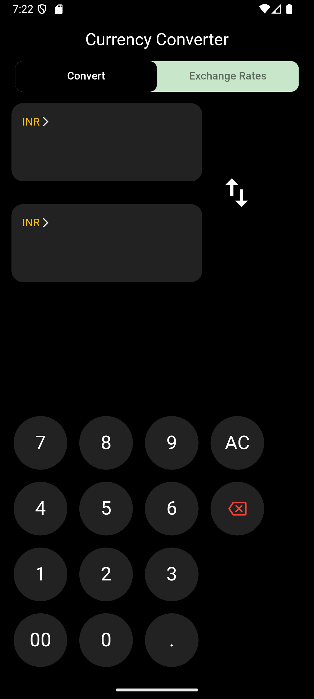
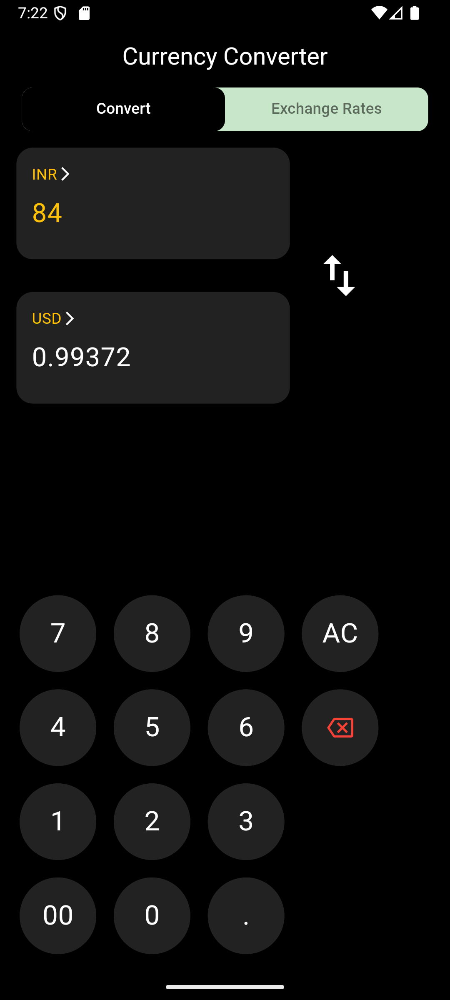
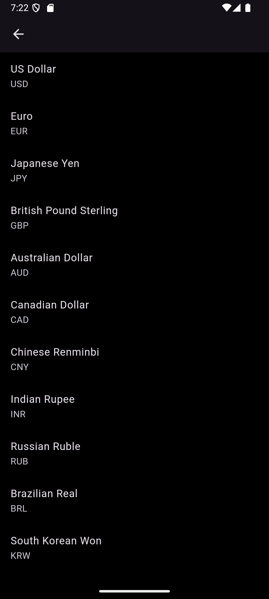
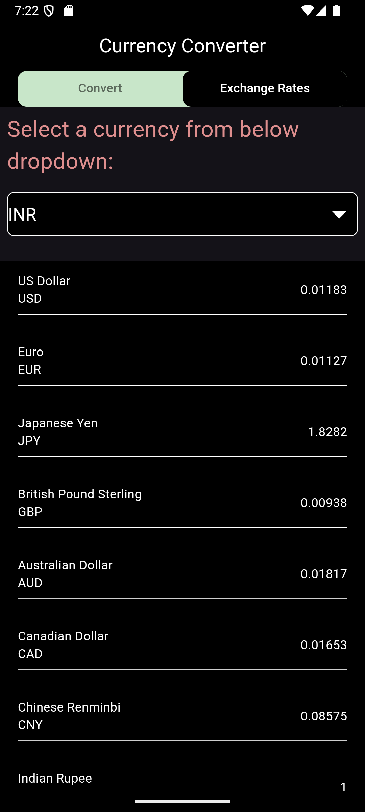

## currency_converter

## Download

You can download the latest release APK from the [Releases](https://github.com/ankit14-dev/Currency-Converter/releases) page.

## Installation

1. Download the APK file from the [Releases](https://github.com/ankit14-dev/Currency-Converter/releases) page.
2. On your Android device, go to Settings > Security.
3. Enable "Unknown Sources" to allow the installation of apps from sources other than the Google Play Store.
4. Open the downloaded APK file and follow the instructions to install the app.
## Features

- Convert between multiple currencies
- Real-time exchange rates
- Historical data for exchange rates
- User-friendly interface

## Screenshots






## Demo


## Building

1. Clone the repository:
    ```sh
    git clone https://github.com/ankit14-dev/Currency-Converter.git
    ```
2. Navigate to the project directory:
    ```sh
    cd Currency_Converter
    ```
3. Install dependencies:
    ```sh
    flutter pub get
    ```

## Usage

1. Run the app:
    ```sh
    flutter run
    ```

## Contributing

1. Fork the repository
2. Create a new branch (`git checkout -b feature-branch`)
3. Make your changes
4. Commit your changes (`git commit -m 'Add some feature'`)
5. Push to the branch (`git push origin feature-branch`)
6. Open a pull request

## License

This project is licensed under the MIT License - see the [LICENSE](LICENSE) file for details.

## Contact

For any inquiries, please contact [ankitkr.ak14@gmail.com](mailto:ankitkr.ak14@gmail.com).
